# makePalette 

<!-- badges: start -->


[](https://github.com/ellerbrock/open-source-badges/)
[](https://www.repostatus.org/#active)
[](https://svgshare.com/i/Zhy.svg)

[](https://CRAN.R-project.org/package=makePalette)
[](https://CRAN.R-project.org/package=makePalette)

<!-- badges: end -->

[**makePalette**](https://github.com/musajajorge/makePalette/) is a package containing functions that allow you to create your own color palette from an image, using mathematical algorithms.

## Installation :arrow_double_down:

Install **makePalette** from [**CRAN**](https://CRAN.R-project.org/package=makePalette):

``` r
install.packages("makePalette")
```

## Usage :muscle:

``` r
library(makePalette)
```

You need an image in jpg, png, tiff or similar format, stored in the hard disk of your PC or in some url.

### Examples with the makePaletteCLARA function (Clustering Large Applications)

#### Example 1

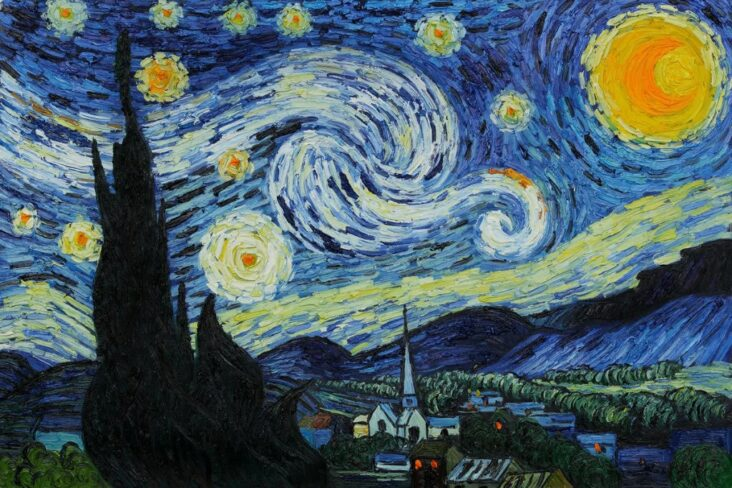

``` r
url1 = "https://github.com/musajajorge/makePalette/raw/main/imgs/picture01.jpeg"
colors <- makePaletteCLARA(url1)
barplot(1:length(colors), col=colors)
```

By default, the function will return a palette of 4 colors.

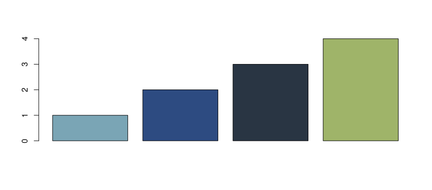

If you want a palette with more colors, just specify it in the *n* parameter. 

``` r
colors <- makePaletteCLARA(url1, n = 10)
barplot(1:length(colors), col=colors)
```

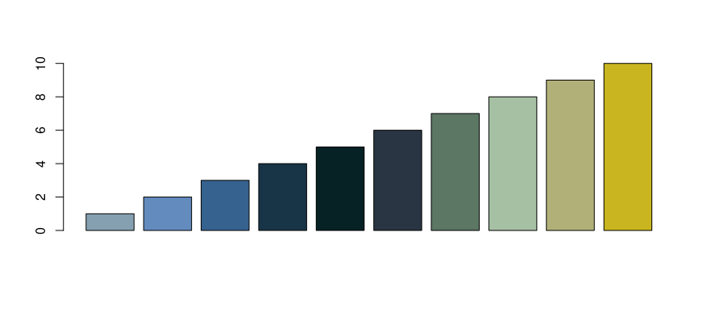

#### Example 2


``` r
url3 = "https://github.com/musajajorge/makePalette/raw/main/imgs/picture03.jpg"
colors <- makePaletteCLARA(url3, n = 6)
barplot(1:length(colors), col=colors)
```

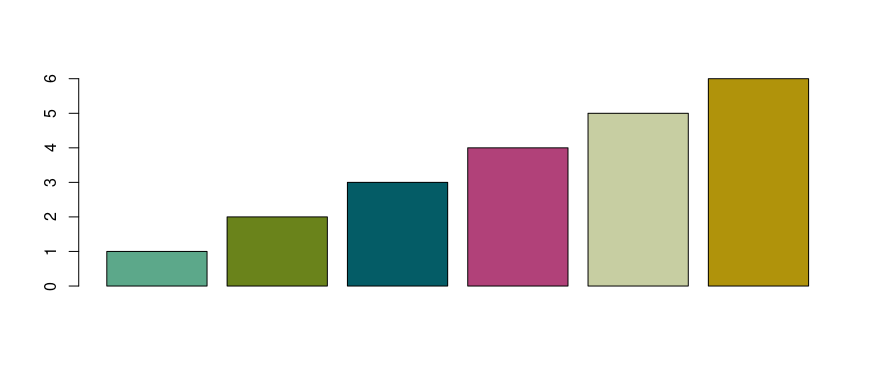

#### Example 3


``` r
url5 = "https://github.com/musajajorge/makePalette/raw/main/imgs/picture05.png"
colors <- makePaletteCLARA(url5, n = 6)
barplot(1:length(colors), col=colors)
```

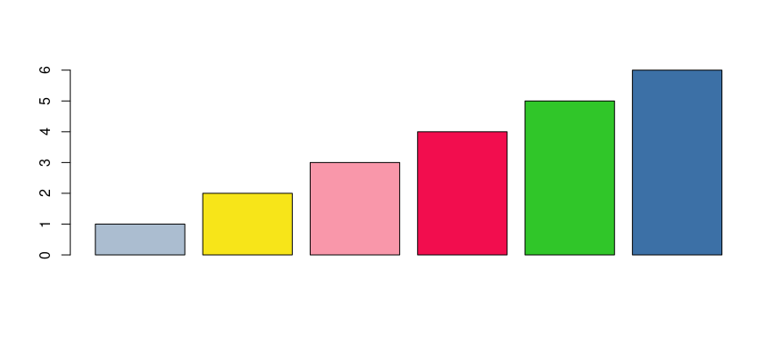

#### Example 4


``` r
url6 = "https://github.com/musajajorge/makePalette/raw/main/imgs/picture06.png"
colors <- makePaletteCLARA(url6, n = 6)
barplot(1:length(colors), col=colors)
```

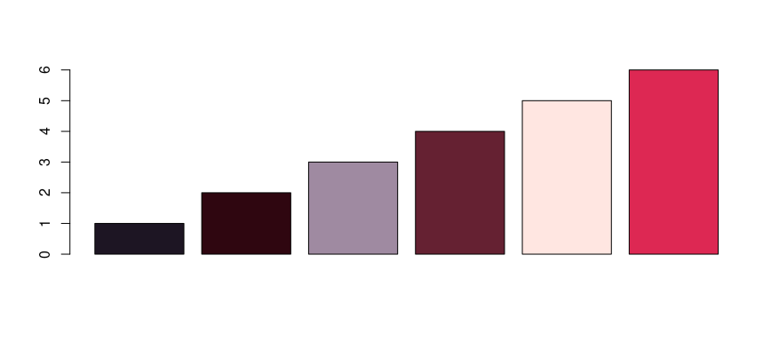

### Examples with the makePaletteKM function (k-Means)

#### Example 5

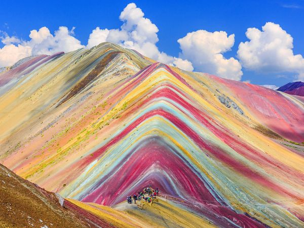

``` r
url2 = "https://github.com/musajajorge/makePalette/raw/main/imgs/picture02.jpg"
colors <- makePaletteKM(url2, n = 10)
barplot(1:length(colors), col=colors)
```

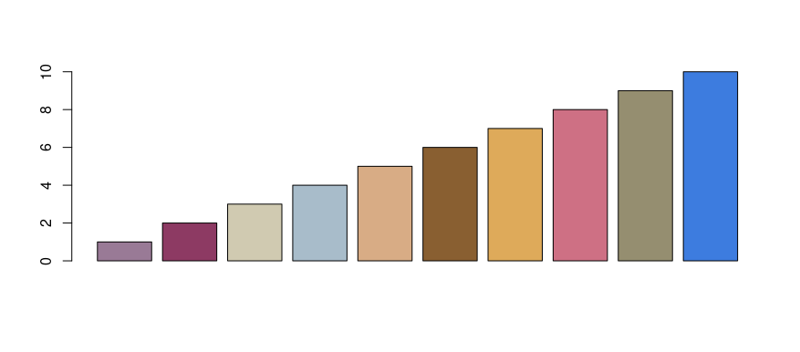

#### Example 6

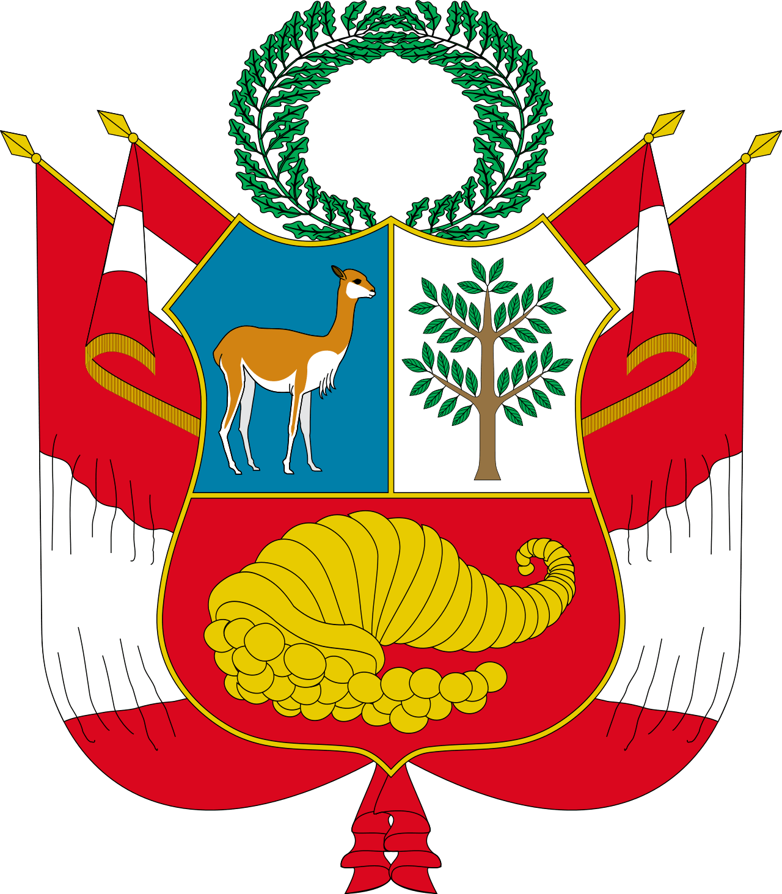

``` r
url4 = "https://github.com/musajajorge/makePalette/raw/main/imgs/picture04.tiff"
colors <- makePaletteKM(url4, n = 6)
barplot(1:length(colors), col=colors)
```

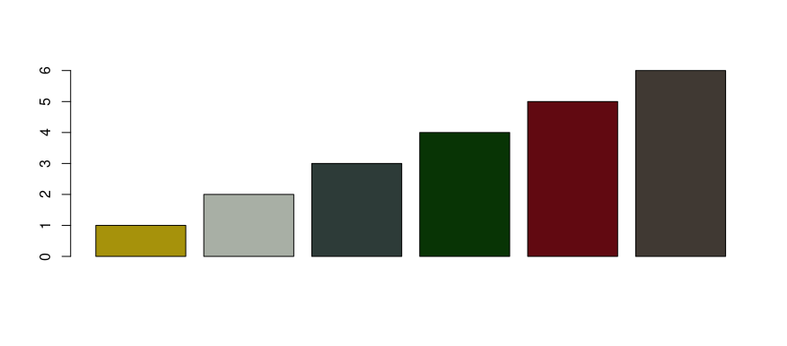

#### Example 7


``` r
url6 = "https://github.com/musajajorge/makePalette/raw/main/imgs/picture06.png"
colors <- makePaletteKM(url6, n = 10)
barplot(1:length(colors), col=colors)
```

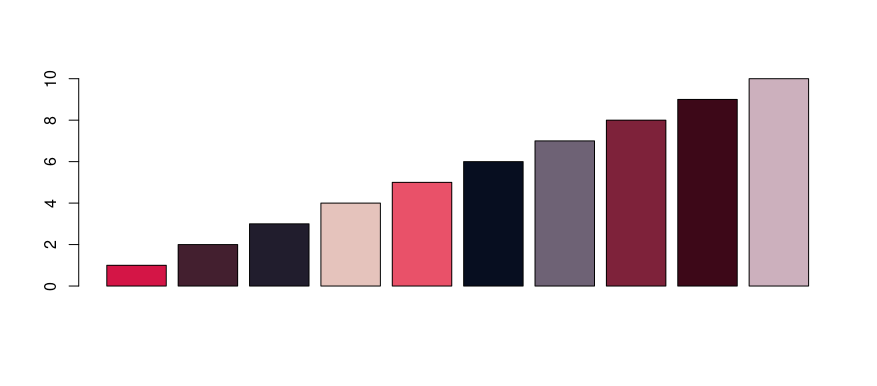

------------

<p align="center">
    
</p>
